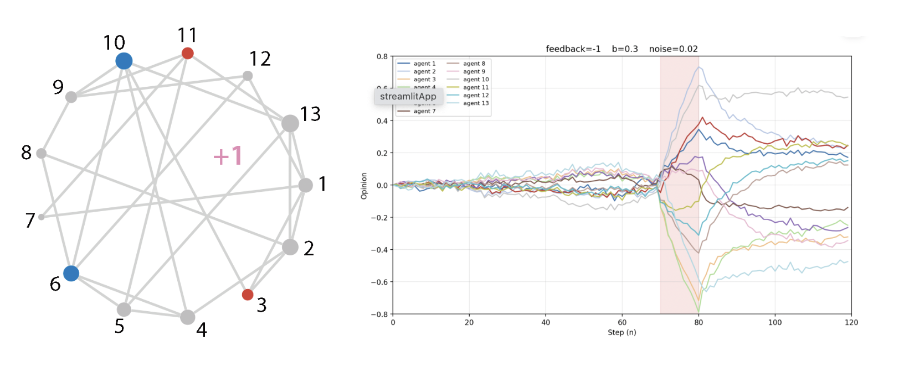

# Opinion Dynamics Network Simulator

This app simulates the evolution of opinion dynamics over time on a communication network graph.

Each node in the graph represents an agent (individual, robot, satellite etc), and each edge represents a communication link between agents. 
Opinions evolve iteratively according to the network structure and model parameters.

The simulator allows users to explore how local interactions generate collective behaviors such as:

- consensus  
- polarization  
- clustering  
- instability  
- bifurcation behavior  
- sensitivity to perturbations  

---



[Open Live App](https://edric-zhang-opinion-dynamics.streamlit.app)

---

## Scientific Background
> Leonard, N. E., Bizyaeva, A., & Franci, A. (2024).  *Fast and Flexible Multiagent Decision-Making. *
> Annual Review of Control, Robotics, and Autonomous Systems, 7, 19–45.

For additional details of the experimental setup, please refer to **Figure 2** of this paper.

---

## Mathematical Model

The opinion state evolves as a discrete linear system:

```
x(t+1) = A x(t)
```

where `x(t)` is the vector of agent opinions at time `t` and `A` is the
communication/influence matrix encoding the network structure.

---

## Usage

> **Note:** Users can set the parameters at the top of
> `communication-network-graph.py` before running.

| Parameter  | Values | Description |
|------------|--------|-------------|
| `feedback` | `1` or `-1` | Switches the communication graph structure |
| `b`        | `0.1` or `0.3` | External push applied to agents 3, 6, 10, 11 |
| `noise`    | `0.02` | Amplitude of random perturbations |
| `steps`    | integer | Total simulation steps (1 step = 0.1 s) |

Run the script, then inspect the time-evolution plots to visualise opinion
trajectories and compare outcomes across network configurations.


## Results

| `feedback` | `b`   | Outcome |
|------------|-------|---------|
| `+1`       | `0.1` | System remains near neutral — small input has little
effect |
| `+1`       | `0.3` | Strong response to large input; cascade into agreement |
| `−1`       | `0.1` | System remains near neutral |
| `−1`       | `0.3` | Cascade into disagreement despite small input |

---

## Features

- Custom communication network graph
- Matrix-based opinion updates
- External input (bias) and noise injection
- Time-evolution plots of all agents
- Multiple simulation scenarios for comparison

---


## Files

| File | Description |
|------|-------------|
| `communication-network-graph.py` | Main simulation script |
| `communication-network-graph.streamlit.py` | Interactive Streamlit web app |
| `requirements.txt` | Python dependencies for the project |
| `README.md` | This document |


---

## Author

**Edric Zhang**

Created for exploration of collective behaviour in network systems. Opinion
exchange and feedback control determine the emergence of an implicit distributed
network threshold for the formation of strong opinions in response to external
input.

